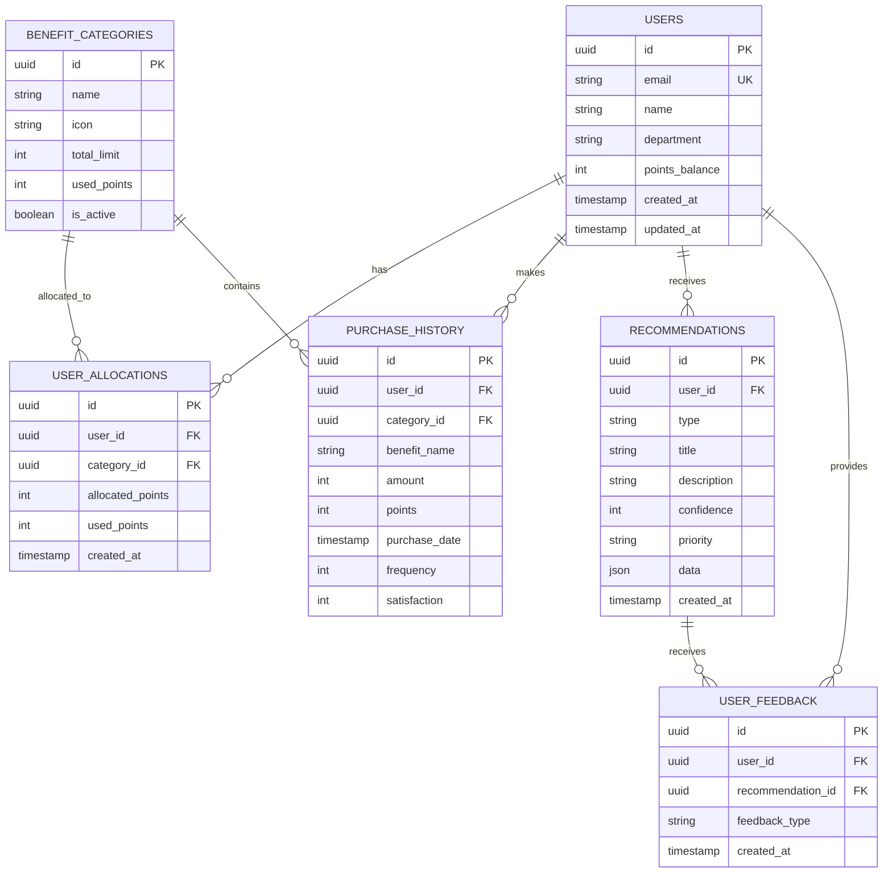
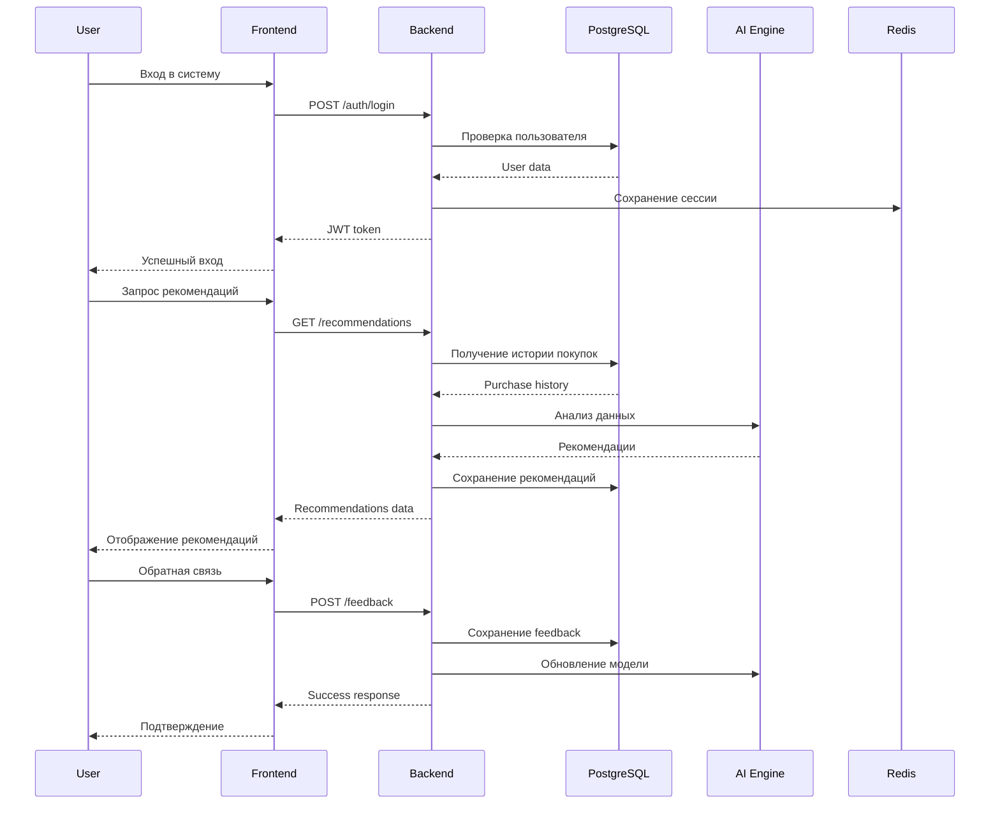

# 🏗️ Архитектура Benefit AI Portal

## Обзор системы

Benefit AI Portal построен на современной микросервисной архитектуре с использованием React, TypeScript и AI-технологий для персонализации рекомендаций.

## Архитектурная диаграмма

```
┌─────────────────┐    ┌─────────────────┐    ┌─────────────────┐
│   Frontend      │    │   Backend API   │    │   AI Engine     │
│   (React/TS)    │◄──►│   (Node.js)     │◄──►│   (Python)      │
└─────────────────┘    └─────────────────┘    └─────────────────┘
         │                       │                       │
         │                       │                       │
         ▼                       ▼                       ▼
┌─────────────────┐    ┌─────────────────┐    ┌─────────────────┐
│   PostgreSQL    │    │   Redis Cache   │    │   ML Models     │
│   (Primary DB)  │    │   (Session)     │    │   (TensorFlow)  │
└─────────────────┘    └─────────────────┘    └─────────────────┘
```

## Компоненты системы

### 1. Frontend Layer
- **React 18** с TypeScript для типобезопасности
- **Vite** для быстрой сборки и HMR
- **Tailwind CSS** для стилизации
- **Radix UI** для доступных компонентов
- **React Router** для навигации
- **React Query** для управления состоянием

### 2. Backend Layer
- **Node.js** с Express.js
- **TypeScript** для типобезопасности
- **JWT** для аутентификации
- **bcrypt** для хеширования паролей
- **CORS** для безопасности

### 3. Database Layer
- **PostgreSQL 15** как основная БД
- **Redis** для кэширования сессий
- **Prisma ORM** для работы с БД

### 4. AI/ML Layer
- **Python 3.11** для ML моделей
- **TensorFlow/Keras** для нейронных сетей
- **Scikit-learn** для классических алгоритмов
- **Pandas/Numpy** для обработки данных

## Диаграмма базы данных (ERD)



## Диаграмма последовательности (UML)



## Технологический стек

### Frontend
- **React 18.2** - Основной фреймворк
- **TypeScript 5.0** - Типизация
- **Vite 5.0** - Сборщик
- **Tailwind CSS 3.3** - Стили
- **Radix UI** - Компоненты
- **React Router 6.8** - Маршрутизация
- **React Query 5.0** - Управление состоянием

### Backend
- **Node.js 20.0** - Runtime
- **Express.js 4.18** - Web framework
- **TypeScript 5.0** - Типизация
- **Prisma 5.0** - ORM
- **JWT** - Аутентификация
- **bcrypt** - Хеширование

### Database
- **PostgreSQL 15** - Основная БД
- **Redis 7.0** - Кэш
- **pgAdmin** - Администрирование

### AI/ML
- **Python 3.11** - ML runtime
- **TensorFlow 2.13** - Нейронные сети
- **Scikit-learn 1.3** - Классические алгоритмы
- **Pandas 2.0** - Обработка данных
- **NumPy 1.24** - Математические операции

### DevOps
- **Docker** - Контейнеризация
- **GitHub Actions** - CI/CD
- **Vercel** - Deployment
- **Sentry** - Мониторинг ошибок

## Принципы архитектуры

### 1. Микросервисная архитектура
- Разделение ответственности между сервисами
- Независимое развертывание
- Масштабируемость компонентов

### 2. Event-Driven Architecture
- Асинхронная обработка событий
- Слабая связанность компонентов
- Высокая производительность

### 3. API-First подход
- RESTful API для всех операций
- OpenAPI спецификации
- Версионирование API

### 4. Безопасность
- JWT токены для аутентификации
- HTTPS для всех соединений
- Валидация входных данных
- Защита от SQL-инъекций

### 5. Производительность
- Кэширование с Redis
- Оптимизация запросов к БД
- Lazy loading компонентов
- CDN для статических ресурсов

## Масштабирование

### Горизонтальное масштабирование
- Load balancer для распределения нагрузки
- Репликация PostgreSQL
- Кластеризация Redis
- Микросервисы в Docker контейнерах

### Вертикальное масштабирование
- Увеличение ресурсов серверов
- Оптимизация запросов к БД
- Кэширование на всех уровнях
- Сжатие данных

## Мониторинг и логирование

### Метрики
- Prometheus для сбора метрик
- Grafana для визуализации
- Health checks для всех сервисов
- Performance monitoring

### Логирование
- Structured logging с JSON
- Centralized log aggregation
- Error tracking с Sentry
- Audit trails для безопасности 