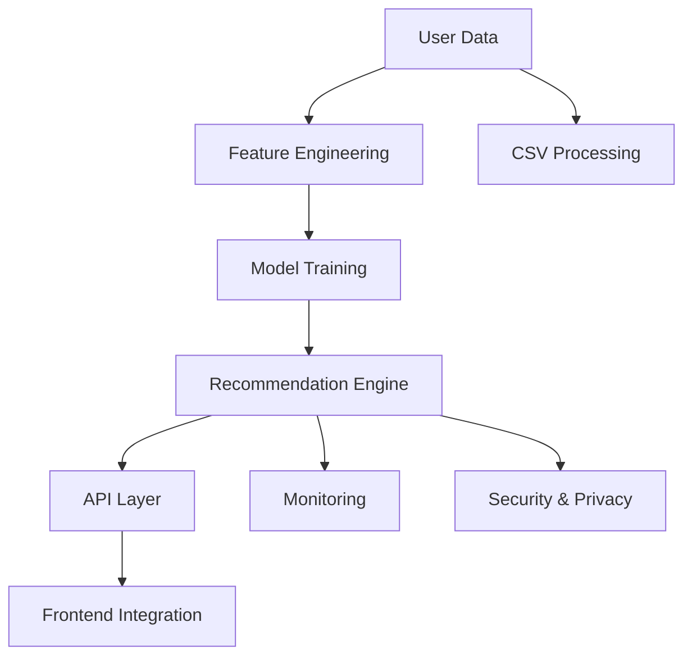

# AI/ML Architecture — Benefit AI Portal

## Overview
The AI subsystem is modular, extensible, and ready for real API/model integration. It consists of the following layers:

- **Data Collection & Feature Engineering**
- **Model Training & Inference**
- **Recommendation Algorithms (Collaborative, Content-Based, Hybrid, ML models)**
- **Batch & Real-Time Processing**
- **A/B Testing**
- **Monitoring & Logging**
- **Security & Privacy**
- **CSV Processing** (bulk import/export for analytics and user data)

## Block Diagram

## Key Modules
- See [../models/](../models/) for model implementations
- See [../algorithms/](../algorithms/) for algorithms
- See [../monitoring/](../monitoring/) for metrics and logging
- See [../security/](../security/) for privacy and protection
- See [../utils/csvUtils.ts](../utils/csvUtils.ts) for CSV logic
- See [../hooks/useCSVUpload.ts](../hooks/useCSVUpload.ts) for React CSV integration
- See [ALGORITHMS.md](./ALGORITHMS.md) for algorithm details
- See [METRICS.md](./METRICS.md) for metrics
- See [SECURITY.md](./SECURITY.md) for privacy
- See [API.md](./API.md) for API reference
- See [CSV.md](./CSV.md) for CSV processing 